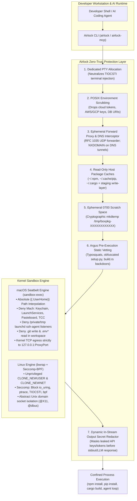
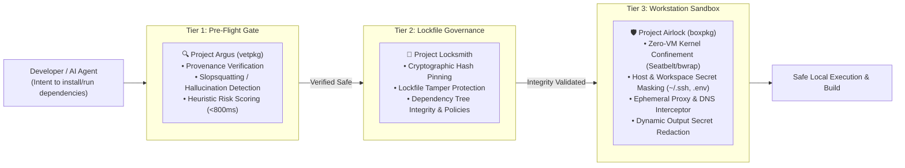

# Airlock 🛡️

> **Minimalist Zero-Trust Workstation Sandbox for Untrusted Package Installs & Autonomous AI Coding Agents**  
> *Target Startup Overhead: <15ms (Measured: ~7.9ms) | Footprint: Zero-VM / Zero-Daemon | Platform: macOS & Linux*  

[](https://github.com/bonjoski/airlock/actions/workflows/ci.yml)
[](https://github.com/bonjoski/airlock/releases)
[](https://opensource.org/licenses/MIT)
[](https://docs.sigstore.dev)

Airlock (`airlock`, aliased as `boxpkg`) provides sub-8ms, zero-VM process confinement for package managers (`npm`, `pip`, `cargo`, `uv`, `bun`, `pnpm`, `yarn`) and autonomous AI coding agents (Claude Desktop, Cursor, Gemini CLI, Antigravity) directly on developer workstations.

---

## 🛑 Why Airlock is Needed (The Problem)

### 1. Package Managers Run Arbitrary Code as You
Every modern package manager executes arbitrary code during installation and build routines:
* **Node.js**: `preinstall`, `postinstall`, `prepare` lifecycle scripts in `package.json`
* **Python**: Dynamic execution inside `setup.py` / `pip install`
* **Rust**: Unrestricted host build scripts in `build.rs`
* **Ruby**: Native C extension builders in `extconf.rb` / `Rakefile`

A single typosquatted, hijacked, or malicious dependency executes with **your exact user permissions**, giving attackers instant access to:
* **Host Secrets:** `~/.ssh/id_rsa`, `~/.aws/credentials`, `~/.gnupg`, `~/.kube/config`, `~/.config/gcloud`
* **Workspace Secrets:** `.env`, `.env.local`, `*.pem`, database credentials, private API keys
* **Persistent Backdoors:** Writing malicious git hooks into `.git/hooks/pre-commit` or poisoning `.git/config`
* **Network Exfiltration:** Bypassing advisory proxy settings via raw TCP sockets, DNS tunneling, or reverse shells
* **Host Daemon Escapes:** Accessing `/var/run/docker.sock` to spawn privileged root containers

### 2. AI Coding Agents Execute Shell Loops on Your Machine
Autonomous coding agents (Claude Desktop, Cursor, Gemini CLI, Antigravity, Claude Code) routinely run terminal commands and install dependencies to solve programming tasks. Without kernel sandboxing, a hallucinated package name or an indirect prompt injection attack in untrusted code can compromise your entire system.

### 3. Traditional Sandboxes & VMs Don't Work for Workstations
* **Docker / VMs:** Heavyweight, slow startup (>2-5s), broken filesystem permissions, cold package cache penalties (>90s downloads), and complex port forwarding.
* **Advisory Env (`HTTP_PROXY`):** Malicious binaries simply ignore environment variables and make direct raw socket connections or UDP DNS tunneling queries.

---

## 💡 How Airlock Solves It

Airlock enforces **Kernel-Level Zero-Trust Confinement** without VMs, daemons, or performance degradation:



---

## 🌐 The Supply Chain Defense Suite

Airlock is the runtime confinement engine of the **Unified Supply Chain Defense Suite** created by [@bonjoski](https://github.com/bonjoski). Together, these three tools provide comprehensive defense-in-depth across the entire dependency lifecycle:



### The Three Defense Pillars

| Tool | Focus & Purpose | Integration with Airlock |
| :--- | :--- | :--- |
| **[Argus](https://github.com/bonjoski/argus)** (`vetpkg`) | **Pre-Flight Provenance & Threat Vetting:** Queries upstream registries in real time to intercept hallucinated packages, typosquatting/slopsquatting, obfuscated `setup.py` scripts, and suspicious `build.rs` network logic before download. | Airlock embeds Argus rules directly into its pre-execution heuristic engine (`pkg/vet`, `--vet`, `--vetpkg`, and `airlock_vet` MCP tool). |
| **[Locksmith](https://github.com/bonjoski/locksmith)** | **Lockfile Integrity & Governance:** Validates, cryptographically pins, and audits multi-ecosystem lockfiles (`package-lock.json`, `pnpm-lock.yaml`, `Cargo.lock`, `poetry.lock`), ensuring immutable dependency graphs and preventing unauthorized upstream drift. | Locksmith ensures that *only* cryptographically verified packages enter the pipeline, while Airlock guarantees that their installation hooks cannot escape the workstation boundary. |
| **[Airlock](https://github.com/bonjoski/airlock)** (`boxpkg`) | **Zero-VM Runtime Process Confinement:** Provides ultra-fast (<8ms) OS kernel sandbox isolation, secret masking (`~/.ssh`, `.env`), proxy egress enforcement, and in-stream secret redaction during dependency execution. | The final, unbypassable execution boundary protecting developer workstations and autonomous AI agent loops. |

---

## 🚀 Quickstart (Zero to Protected in 60 Seconds)

### Step 1: Install Airlock

#### Option A: Standalone POSIX Installer (macOS & Linux)
```bash
curl -fsSL https://raw.githubusercontent.com/bonjoski/airlock/main/install.sh | sh
```

#### Option B: Homebrew (macOS & Linux)
```bash
brew install bonjoski/airlock/airlock
```

#### Option C: Go Install
```bash
go install github.com/bonjoski/airlock/cmd/airlock@latest
go install github.com/bonjoski/airlock/cmd/airlock-mcp@latest
```

---

### Step 2: Verify System Readiness (`airlock doctor`)
Run system diagnostics to verify kernel sandbox drivers, cache directories, and loopback proxies:
```bash
airlock doctor
```
```
Airlock Doctor — System Diagnostics & Health Report
==================================================
Platform:       darwin/arm64
Workspace Root: /Users/username/my-project

[Platform Sandbox Primitives]
  ✓ PASS sandbox-seatbelt-exec: macOS Seatbelt executable (sandbox-exec)
  ✓ PASS sandbox-seatbelt-profile: macOS Seatbelt profile synthesis (Seatbelt SBPL)

[Storage & Permissions]
  ✓ PASS storage-airlock-dir: Airlock state directory (~/.airlock) is writable
  ✓ PASS storage-npm-cache: Node / npm cache (~/.npm) is accessible
  ✓ PASS storage-cargo-cache: Rust / Cargo cache (~/.cargo/registry) is accessible
  ✓ PASS storage-scratch-dirs: Ephemeral scratch directory creation (mode 0700)

[Network & Proxy]
  ✓ PASS network-port-binding: Loopback socket binding (127.0.0.1) verified
  ✓ PASS network-dns-filter: In-process DNS filtering proxy active

[Toolchain Shims]
  ✓ PASS shims-path-configured: Toolchain shims active in $PATH (~/.airlock/bin)

Summary: 10 passed, 0 warnings, 0 failures (System HEALTHY)
```

---

### Step 3: Enable Transparent Package Manager Shims
Install lightweight shell shims for `npm`, `npx`, `pnpm`, `yarn`, `pip`, `pip3`, `cargo`, `uv`, and `bun`:
```bash
airlock shim install
```
Add `~/.airlock/bin` to your `~/.zshrc` or `~/.bashrc`:
```bash
export PATH="$HOME/.airlock/bin:$PATH"
```
🎉 **That's it!** All future `npm install`, `pip install`, and `cargo build` commands run automatically inside zero-trust kernel sandboxes with zero behavioral changes.

---

### Step 4: Run Commands Manually
You can also run commands explicitly through Airlock:
```bash
# Shorthand syntax
airlock npm install
airlock pip install -r requirements.txt
airlock cargo build
airlock bun add lodash

# Explicit syntax with custom allowed network domains
airlock run --allow-domain api.mycorp.internal -- npm install
```

---

## 🤖 AI Assistant & IDE Integration (Model Context Protocol)

Airlock includes a dedicated, high-performance **Model Context Protocol (MCP)** server (`airlock-mcp` or `airlock mcp`) providing autonomous AI coding agents with zero-trust execution, pre-execution threat vetting, and security policy introspection.

### 1. Claude Desktop Setup
Add the following to `~/Library/Application Support/Claude/claude_desktop_config.json` (macOS) or `~/.config/Claude/claude_desktop_config.json` (Linux):
```json
{
  "mcpServers": {
    "airlock": {
      "command": "airlock-mcp",
      "args": []
    }
  }
}
```

### 2. Cursor IDE Setup
Add the following to `.cursor/mcp.json` in your project workspace:
```json
{
  "mcpServers": {
    "airlock": {
      "command": "airlock-mcp",
      "args": []
    }
  }
}
```

### 3. Gemini CLI / Antigravity Setup
Add to your agent configuration settings:
```json
{
  "mcpServers": {
    "airlock": {
      "command": "airlock",
      "args": ["mcp"]
    }
  }
}
```

---

### MCP Capabilities Reference

#### Tools
* **`airlock_exec`**: Safely executes shell commands inside sandboxed confinement with strict network domain filtering, directory masking, and dynamic secret redaction.
* **`airlock_vet`**: Runs Argus static heuristics to detect typosquatting packages, obfuscated `setup.py` scripts, and malicious `build.rs` outbound connections prior to execution.
* **`airlock_policy_check`**: Inspects whether specific egress domains, filesystem paths, or environment variables comply with active policy and invariant guardrails.

#### Resources
* **`airlock://audit/recent`**: Tail of the last 50 structured audit records (executions, denied egress attempts, blocked DNS tunneling).
* **`airlock://policy/active`**: Active project `airlock.yaml` policy, effective allowlists, and immutable security guardrails.
* **`airlock://health`**: Real-time system sandbox isolation status and kernel capability health.

#### Prompts
* **`security_review`**: Guides the AI assistant to perform comprehensive supply chain and security reviews on workspace code.
* **`pre_install_audit`**: Prompt template for evaluating third-party dependencies before installation.
* **`sandbox_troubleshoot`**: Diagnostic prompt for analyzing permission denials or blocked network domains.

---

## ⚡ Performance Benchmarks (< 15ms SLA Target)

Airlock is engineered for developer workstation use without noticeable latency overhead:

| Benchmark Operation | Target SLA | Measured Performance | Margin vs Target |
| :--- | :---: | :---: | :---: |
| **Sandbox Process Invocation Overhead** | `< 15.00 ms` | **7.88 ms / op** (~6.35 ms overhead vs 1.53 ms baseline) | **1.9x faster** |
| **Ephemeral Egress Proxy Handshake** | `< 2.00 ms` | **0.15 ms / op** (153.78 µs) | **13x faster** |
| **Proxy Data Throughput** | `> 500 MB/s` | **1,145.99 MB/s** (1.14 GB/s) | **2.3x higher** |
| **In-Process DNS Forwarder UDP Latency** | `< 5.00 ms` | **0.026 ms / op** (26.59 µs) | **188x faster** |
| **Argus Command Line Inspection** | `< 1.00 ms` | **0.052 ms / op** (52.43 µs) | **19x faster** |
| **Argus Manifest Parsing** | `< 5.00 ms / file` | **0.125 ms / op** (125.64 µs / 4 files) | **40x faster** |

*Benchmarked on Apple Silicon (M3 Max, macOS Darwin arm64) using `go test -v -bench=. ./tests/benchmark_test.go`.*

---

## 🛠️ CLI Subcommands Overview

### 1. `airlock run` (or `airlock <cmd>`)
Executes commands inside kernel-confined isolation:
```bash
airlock run -- npm test
airlock run --airgap -- pytest
airlock run --allow-domain api.openai.com -- python agent.py
```

### 2. `airlock doctor`
Inspects host sandbox readiness, permissions, loopback proxy, and toolchain shims:
```bash
airlock doctor
airlock doctor --json
airlock doctor --workspace /path/to/project
```

### 3. `airlock audit`
Query, tail, and analyze security telemetry in `~/.airlock/audit.log`:
```bash
# List recent audit events
airlock audit list --limit 20

# Filter by type and status
airlock audit list --type network --status deny
airlock audit list --type dns --status deny

# Live tailing of all sandboxed activity
airlock audit tail -f

# Aggregated summary statistics
airlock audit stats

# Export audit trail to JSON or CSV for SIEM ingestion
airlock audit export --format json --output /tmp/audit.json
airlock audit export --format csv --output /tmp/audit.csv
```

### 4. `airlock init` & `airlock config`
Scaffold and validate declarative `airlock.yaml` workspace policies:
```bash
# Generate project policy
airlock init --type node      # Options: node, python, rust, go, general

# Validate policy against immutable security guardrails
airlock config validate --config ./airlock.yaml
```

### 5. `airlock shim`
Manage transparent package manager shims:
```bash
airlock shim install
airlock shim list
airlock shim uninstall
```

---

## 🛡️ 32/32 Adversarial Security Verification Battery

Every CI build executes an automated suite of adversarial attack simulations validating that root zero-trust invariants cannot be bypassed:

| Test ID | Test Name | Invariant | Attack Simulation | Status |
| :--- | :--- | :---: | :--- | :---: |
| **SEC-01** | `TestSEC01_SSHReadDenial` | **V-01** | Evaluates absolute path interpolation for `~/.ssh/id_rsa`. | **[PASS]** |
| **SEC-02** | `TestSEC02_RawSocketEgressDenial` | **V-02** | Raw outbound TCP socket connection attempting proxy bypass (`1.1.1.1:443`). | **[PASS]** |
| **SEC-03** | `TestSEC03_GitHookPersistenceDenial` | **V-03** | Trojan drop into `$PWD/.git/hooks/pre-commit`. | **[PASS]** |
| **SEC-04** | `TestSEC04_WorkspaceSecretDenial` | **V-04** | Reading workspace secrets (`.env`, `.env.local`, `*.pem`, `secrets.json`). | **[PASS]** |
| **SEC-05** | `TestSEC05_EnvSanitization` | **V-07** | POSIX environment allowlist scrubbing credentials and PATH sanitization. | **[PASS]** |
| **SEC-06** | `TestSEC06_DockerSocketDenial` | **V-06** | Accessing `/var/run/docker.sock` to trigger root container escape. | **[PASS]** |
| **SEC-07** | `TestSEC07_UsernsFailClosed` | **V-07** | Simulating disabled unprivileged user namespaces on hardened Linux. | **[PASS]** |
| **SEC-08** | `TestSEC08_ExitCodePropagation` | — | Precise propagation of exit codes and termination signals from sandbox child. | **[PASS]** |
| **SEC-09** | `TestSEC09_IOUringSeccompDenial` | **V-09** | Linux `sys_io_uring_setup`, `ptrace`, and `TIOCSTI` ioctl Seccomp-BPF denial. | **[PASS]** |
| **SEC-10** | `TestSEC10_AbstractSocketNetnsDetachment`| **V-09** | Connecting to abstract Unix domain sockets (`@X11`, `@dbus`) via `CLONE_NEWNET`. | **[PASS]** |
| **SEC-11** | `TestSEC11_ProxyDomainWhitelisting` | **V-02** | Ephemeral forward proxy TLS SNI whitelist enforcement. | **[PASS]** |
| **SEC-12** | `TestSEC12_ScratchOrphanCleanup` | **V-11** | Cryptographic `mkdtemp` (0700) and scavenger purge of abandoned dirs > 24h. | **[PASS]** |
| **SEC-13** | `TestSEC13_CacheStagingAndSync` | **V-12** | Read-only host cache mounts with ephemeral staging and verified sync-back. | **[PASS]** |
| **SEC-14** | `TestSEC14_NestedAirlockBypass` | — | `__AIRLOCK_ACTIVE=1` recursion bypass for nested toolchain invocations. | **[PASS]** |
| **SEC-15** | `TestSEC15_DNSTunnelingNeutralization` | **V-08** | In-process RFC 1035 UDP DNS forwarder returning `NXDOMAIN` on non-whitelisted domains. | **[PASS]** |
| **SEC-16** | `TestSEC16_AuditLogging` | — | Structured JSON-lines audit logging to `~/.airlock/audit.log` (0600 permissions). | **[PASS]** |
| **SEC-17** | `TestSEC17_ShimRecursionPrevention` | **V-14** | Transparent shell shims execution without recursion crashes. | **[PASS]** |
| **SEC-18** | `TestSEC18_ArgusStaticAnalysisHandoff` | — | Argus heuristic analysis and external `vetpkg` binary handoff. | **[PASS]** |
| **SEC-19** | `TestSEC19_TyposquattingInterception` | — | Pre-execution interception of known typosquats (`crossenv`, `reqeusts`). | **[PASS]** |
| **SEC-20** | `TestSEC20_RustBuildRsNetworkInterception`| — | Argus detection of outbound network sockets inside Rust `build.rs`. | **[PASS]** |
| **SEC-21** | `TestSEC21_SetupPyObfuscationInterception`| — | Interception of obfuscated base64 and reverse shell payloads in Python `setup.py`. | **[PASS]** |
| **SEC-22** | `TestSEC22_DeclarativeConfigDomainAllow` | — | Declarative `airlock.yaml` custom domain and wildcard allowlists. | **[PASS]** |
| **SEC-23** | `TestSEC23_DeclarativeConfigGuardrailDenial`| — | Guardrail rejection preventing `airlock.yaml` from overriding zero-trust boundaries. | **[PASS]** |
| **SEC-24** | `TestSEC24_InteractiveCapabilityGrantPrompt`| — | Dynamic interactive terminal prompts for unknown network domains. | **[PASS]** |
| **SEC-25** | `TestSEC25_ConfigInitAndValidation` | — | Policy scaffolding (`airlock init`) and validation against guardrails. | **[PASS]** |
| **SEC-26** | `TestSEC26_MCPSandboxConfinement` | — | Verifying MCP `airlock_exec` executes strictly inside zero-trust kernel sandbox. | **[PASS]** |
| **SEC-27** | `TestSEC27_MCPVetAndPolicyCheck` | — | MCP `airlock_vet` and `airlock_policy_check` tool threat detection and guardrails. | **[PASS]** |
| **SEC-28** | `TestSEC28_DoctorHealthyEnvironment` | — | `airlock doctor` diagnostic suite verifying platform, shims, and scratch health. | **[PASS]** |
| **SEC-29** | `TestSEC29_AuditQueryCapturesThreats` | — | `airlock audit` query engine indexing blocked egress, DNS tunneling, and CSV export. | **[PASS]** |
| **SEC-30** | `TestSEC30_MCPExtensions` | — | MCP protocol compliance for resources (`audit`, `policy`, `health`) and prompts. | **[PASS]** |
| **SEC-31** | `TestSEC31_ExtendedSupplyChainThreats` | — | Argus static analysis detection across Go, Ruby, and Obfuscated Shell pipelines. | **[PASS]** |
| **SEC-32** | `TestSEC32_SecretRedaction` | **V-24** | Dynamic in-stream secret redactor masking API keys/tokens across stdout & MCP. | **[PASS]** |

---

## 🔏 Cryptographic Provenance (Sigstore Cosign)

Every official Airlock release artifact is cryptographically signed using **Sigstore Cosign Keyless OIDC**. Verification is logged publicly in the Rekor transparency log.

To manually verify the provenance of any release:
```bash
cosign verify-blob \
  --bundle checksums.txt.bundle \
  --certificate-identity-regexp "^https://github.com/bonjoski/airlock/" \
  --certificate-oidc-issuer "https://token.actions.githubusercontent.com" \
  checksums.txt
```

---

## 🧪 Local Build & Verification

```bash
# Run unit and integration tests
make test

# Run adversarial security verification suite
make test-sec

# Run micro-benchmarks
make bench

# Build binaries (bin/airlock and bin/airlock-mcp)
make build

# Cross-compile release packages for macOS and Linux
make package
```

---

## 📄 License

MIT License — Copyright (c) 2026 Ben Skolmoski. See [LICENSE](LICENSE) for details.
